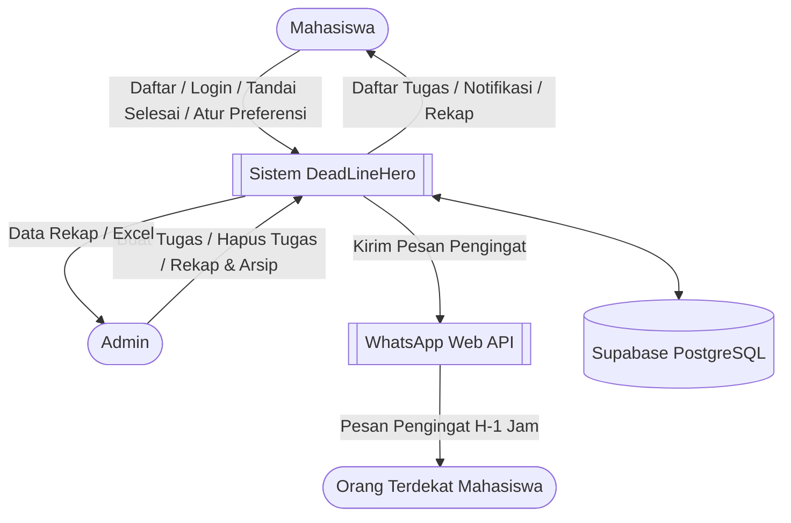
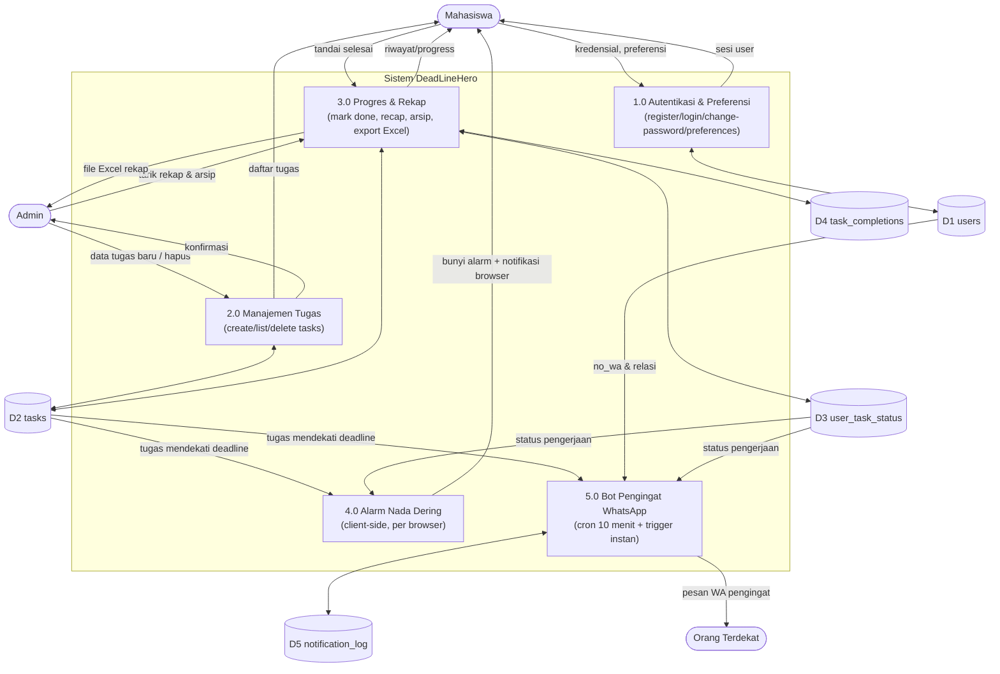
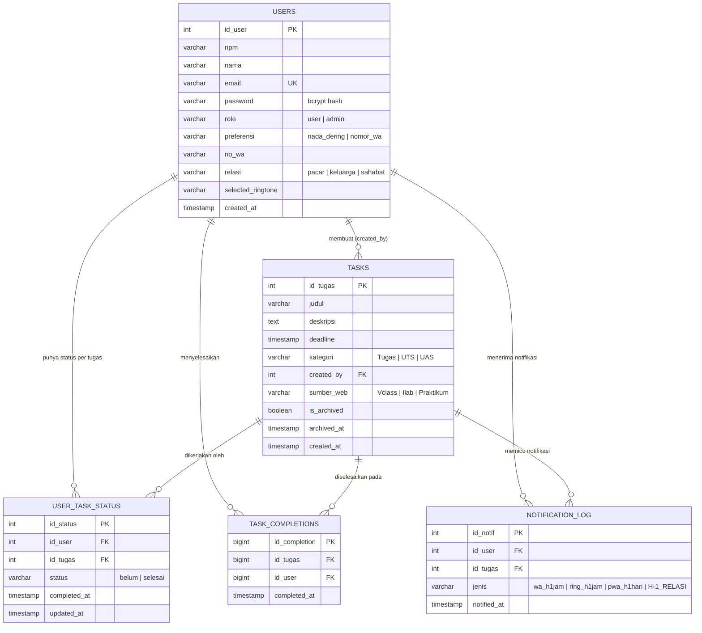

# ARCHITECTURE — DeadLineHero

Dokumen ini merangkas alur data (DFD) dan struktur data (ERD) DeadLineHero
berdasarkan implementasi aktual di `src/server.js`, `src/bot.js`, dan
`database/schema.sql`. Diagram digambar pakai Mermaid supaya langsung
ter-render di GitHub tanpa tool tambahan.

## Ringkasan Sistem

Web app manajemen tugas (Tugas/UTS/UAS) untuk mahasiswa & admin, dengan dua
jalur pengingat otomatis H-1 jam: nada dering di browser (mahasiswa sendiri)
dan pesan WhatsApp ke orang terdekat mahasiswa (pacar/keluarga/sahabat).
Backend Express + PostgreSQL (Supabase), deploy di Railway.

---

## DFD Level 0 (Context Diagram)

---

## DFD Level 1 (Rincian Proses)

**Catatan proses:**
- **P4 (Alarm Nada Dering)** murni berjalan di browser mahasiswa (`public/app.js`), memindai tugas tiap 30 detik + saat data tugas baru diambil. Status "sudah pernah bunyi" disimpan per tugas di `localStorage`, dan id tugas yang sedang berbunyi dipersist ke `sessionStorage` supaya bertahan saat halaman di-refresh. Audio berhenti otomatis hanya kalau **seluruh** tugas aktif (Tugas/UTS/UAS) sudah berstatus selesai — bukan begitu satu tugas saja ditandai selesai.
- **P5 (Bot WhatsApp)** jalan di server (`src/bot.js`) via `whatsapp-web.js` + `node-cron`, mengecek dua jalur: pengingat langsung (`wa_h1jam`, ke nomor `no_wa` milik user itu sendiri) dan pengingat relasi (`H-1_RELASI`, ke nomor `no_wa` semua user berperan relasi untuk tugas milik mahasiswa lain). Dedup terjadi lewat `notification_log`.

---

## ERD

---

## Catatan Arsitektur Lain

- **Single source of truth skema:** `database/schema.sql` adalah acuan struktur tabel Supabase. `ensureRecapSchema()` di `src/server.js` menjalankan migrasi idempoten (`ADD COLUMN IF NOT EXISTS`, dst.) saat startup supaya instance Railway otomatis menyesuaikan tanpa migrasi manual — bukan skema tandingan, hanya penjaga kalau DB live belum disinkron.
- **Autentikasi:** password disimpan sebagai hash bcrypt (`BCRYPT_ROUNDS = 10`). Akun lama (kalau masih ada sisa password plaintext) otomatis di-upgrade ke hash begitu berhasil login sekali — tidak perlu migrasi manual/reset password massal.
- **Deployment:** Railway (Docker `node:20-slim`), volume persistent untuk sesi WhatsApp (`RAILWAY_VOLUME_MOUNT_PATH`).
